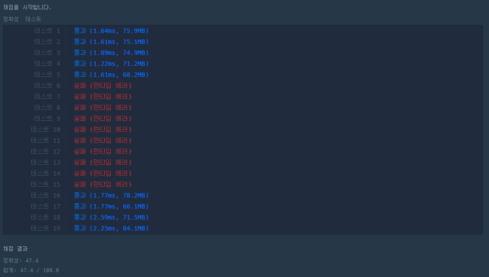

# Programmers Java 피드백

<details>
<summary> :pencil: 2018 KAKAO BLIND RECRUITMENT </summary>
<div markdown="1">

## [1차] 비밀지도

### 내 풀이

```java
class Solution {
    public String[] solution(int n, int[] arr1, int[] arr2) {
        String[] answer = new String[n];
        long plus = 0;
        int len = 0;
        String blank = " ";
        for(int i = 0; i < n; i++) {
            plus = Long.parseLong(Integer.toBinaryString(arr1[i])) + Long.parseLong(Integer.toBinaryString(arr2[i]));
            answer[i] = "";
            len = (int)(Math.log10(plus)+1);
            for(int j = 0; j < len; j++){
                if(plus % 10 == 0){
                    answer[i] = " " + answer[i];
                }
                else {
                    answer[i] = "#"+ answer[i];
                }
                plus = plus / 10;
            }
            if(len != n) {
                answer[i] = blank.repeat(n - len) + answer[i];
            }
        }
        return answer;
    }
}
```

### 풀이과정

- 10진수를 2진수로 변경한 값을 int 형태로 변환하여 더한 값을 plus 변수에 담아줌
- plus 값을 int로 설정했을 경우 런타임 에러가 발생하여 long 으로 변경함
- 원래 문자 보다 길이가 작을 경우 작은 만큼 앞에 0을 채워줌

### 다른 사람 풀이

```java
class Solution {
    public String[] solution(int n, int[] arr1, int[] arr2){
        Stirng[] result = new String[n];
        for(int i = 0; i < n; i++) {
            result[i] = Integer.toBinaryString(arr1[i] | arr2[i]);
        }

        for(int i = 0; i < n; i++) {
            result[i] = String.format("%" + n + "s", result[i]);
            result[i] = result[i].replaceAll("1", "#");
            result[i] = result[i].replaceAll("0", " ");
        }

        return result;
    }
}
```

### 풀이과정

- arr1 과 arr2를 비트 논리 연산자 or를 이용
  - or 연산자: 두 값 중 하나라도 1이면 1, 두 값 모두 1이면 0으로 처리
- String.format() 를 이용하여 n개의 자릿수, 즉 5만큼 문자열을 담는데, 부족하면 0으로 자릿수를 채워줌
</div>
</details>

<details>
<summary> :pencil: 숫자 짝꿍 </summary>
<div markdown="1">

## 숫자 짝꿍

### 1차 풀이 - 실패

- 런타임 에러 발생으로 실패
  

```java
class Solution {
    public String solution(String X, String Y) {
        String answer = "";
        long[] countX = new long[10];
        long[] countY = new long[10];
        long x = Long.parseLong(X);
        long y = Long.parseLong(Y);
        for(int i = 0; i < X.length(); i++){
            long k = x % 10;
            x = x / 10;
            countX[(int)k]++;
        }
        for(int i = 0; i < Y.length(); i++){
            long k = y % 10;
            y = y / 10;
            countY[(int)k]++;
        }
        for(int i = countX.length - 1; i >= 0; i--){
            if(countX[i] == 0 || countY[i] == 0) continue;
            if(countX[i] > 0 && countY[i] > 0) {
                if(i == 0){
                    answer += String.valueOf(i);
                }
                else{
                    int a = Math.min((int)countX[i], (int)countY[i]);
                    answer += String.valueOf(i).repeat(a);
                }
            }
        }
        if(answer == ""){
            answer += "-1";
        }

        return answer;
    }
}
```

- for문을 줄여 문제를 해결하려고 하였지만, 해결되지 않음
- 다른 방법으로 StringBuilder를 사용하여 문제를 해결함

### 최종 풀이

```java
class Solution {
    public String solution(String X, String Y) {
        StringBuilder answer = new StringBuilder();
        int[] countX = new int[10];
        int[] countY = new int[10];

        countNum(X, countX);
        countNum(Y, countY);

        for(int i = countX.length - 1; i >= 0; i--){
            while(countX[i] >= 1 && countY[i] >= 1) {
                countX[i]--;
                countY[i]--;
                answer.append(i);
            }
        }
        if(answer.toString().equals("")){
            return "-1";
        }else if(answer.toString().startsWith("0")){
            return "0";
        }else{
            return answer.toString();
        }
    }

    private void countNum(String str, int[] arr){
        for(int i = 0; i< str.length(); i++){
            int index = str.charAt(i) - '0';
            arr[index]++;
        }
    }
}
```

</div>
</details>

<details>
<summary> :pencil: 전화번호 목록 </summary>
<div markdown="1">

## 전화번호 목록

### 1차 풀이 - 실패

```java
import java.util.Arrays;
import java.util.HashSet;

class Solution {
    public boolean solution(String[] phone_book) {
        boolean answer = true;
        Arrays.sort(phone_book);
        for(int i = 0; i < phone_book.length - 1; i++) {
            if(phone_book[i].equals(phone_book[i+1].substring(0, phone_book[i].length()))) {
                answer = false;
                break;
            }
        }

        return answer;
    }
}
```

- 런타임 에러 발생

  

  - 배열에서 탐색하여 오류가 발생하는 것 같음
  - 배열을 사용하지 않고 map으로 탐색하여 문제를 해결하고자 함

## 2차 풀이 - 성공

```java
import java.util.Map;
import java.util.HashMap;

class Solution {
    public boolean solution(String[] phone_book) {
        boolean answer = true;
        Map<String, Integer> map = new HashMap<>();
        for(String s: phone_book) map.put(s, 1);

        for(String s: phone_book) {
            for(int i = 1; i < s.length(); i++) {
                if(map.containsKey(s.substring(0,i))) return answer = false;
            }
        }

        return answer;
    }
}
```

</div>
</details>
